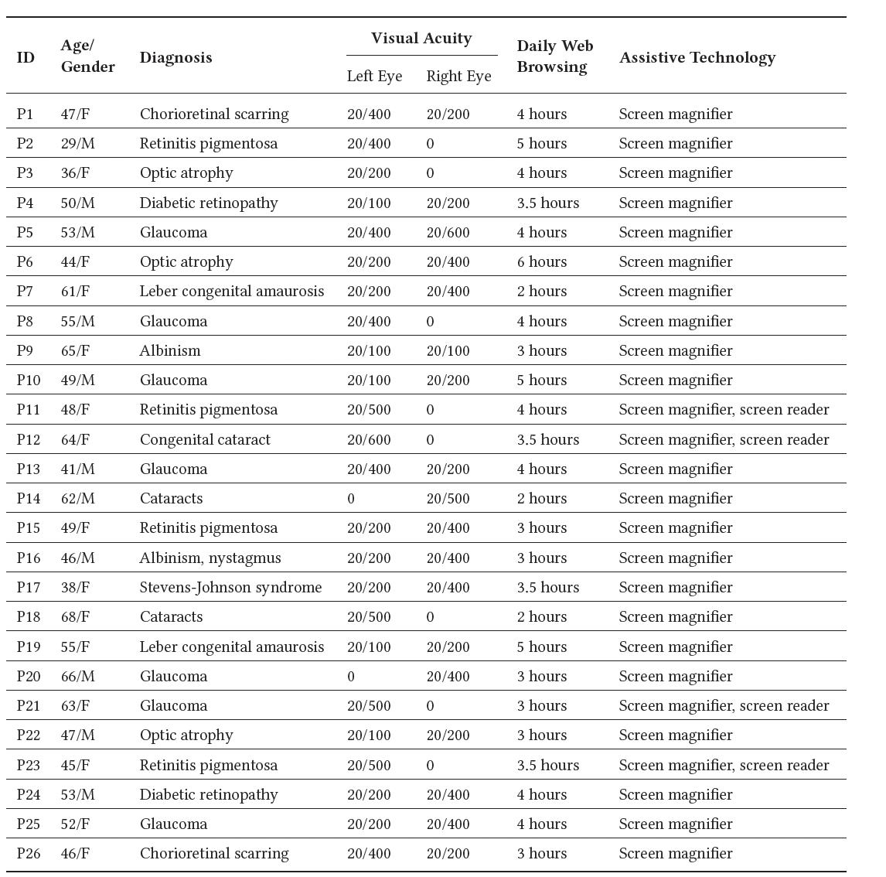

# Evaluation of GraphLite

We conducted an IRB-approved user study with low-vision screen magnifier users to assess the efficacy of GraphLite and compare it with the status-quo screen magnifier as well as a state-of-the-art usability-enhancing solution.

## 1. Participants

Through emails, word-of-mouth, and assistance from non-profit institutions catering to people with visual disabilities, we managed to recruit 26 low-vision participants (16 female, 10 male) for the study16. To ensure external validity, we did not recruit any participant from the pool of participants who took part in the earlier interview study. The average age of the participants was 51.23 (Median = 9.89, Min = 29, Max = 68). The inclusion criteria were similar to that in our earlier interview study  - the participants had to be: (i) users of screen magnification assistive technology; (ii) familiar with smartphone web browsing, and (iii) familiar with data charts. People with severe visual impairments who could only use a screen reader for interaction were not included in the study. Table presents the participants’ demographic information. All participants stated that they primarily relied on screen magnification to interact with their smartphone browser, only some participants mentioned that in rare cases, they also used a screen reader in addition to screen magnifier when it was too difficult to interact conveniently with just the screen magnifier alone. All participants also mentioned that regularly browsed the web on smartphones and frequently came across bar charts during browsing, especially while surfing news articles. No participant reported other physical difficulties (e.g.,
hearing, motor control) that could affect their ability to perform the study tasks.

## 2. Apparatus

For the study, we built a separate all-in-one Android app supporting all the study conditions. This app was installed on the Samsung Galaxy S23 Ultra smartphone with main display size of 6.8 inches, which was then used in the study. We selected this phone because in the interview study, many participants had mentioned that they preferred to use big-screen smartphones. The smartphone screen was configured to a resolution of 3088 x 1440 pixels and a refresh rate of 120 Hz. The study app offered an array of customizable features aimed at optimizing the presentation of bar charts on smartphone displays. At the start of the session, the bars in the charts were rendered in the default shade of green against a white backdrop, and the default font was Times New Roman with font size of 14px. Each bar had a width of 0.6cm. The app allowed the experimenter to assign charts to conditions and then set the order of the conditions before conducting the study with a participant. The two target task bars in the bar charts were annotated with an easily noticeable black dot similar to those used in prior experiments. Furthermore, in an effort to create an accommodating user interface, we also incorporated the iOS-style panning and zooming functionalities, which could be enabled through the app’s configuration settings. This ensured that participants who were iPhone users could comfortably do the tasks to the best extent possible on our Android device.

## 3. Procedure

The experimenter first obtained the participant’s formal consent before briefly explaining the study’s goals. The experimenter then introduced the TBL and GraphLite interfaces to the participant, and conducted a practice session of about 30 minutes to help the participant get comfortable using the TBL and GraphLite interfaces. After the practice session, the experimenter asked the participant to complete the study tasks in the corresponding predetermined counterbalanced order. The experimenter allotted 10 minutes for the participant to complete each task. After each task (and thereby condition), the experimenter administered the System Usability Scale (SUS) and NASA Task Load Index (NASA-TLX) [33] subjective questionnaires to capture the participant’s perceived usability and interaction workload in that condition. Throughout the study, the experimenter took notes to capture any peculiar user interaction behaviors while doing the tasks. At the end of the study, the experimenter engaged in an open-ended conversation with the participant to collect subjective feedback, including feature requests and improvement ideas. With the participant’s consent, all study activities and data (including screen-capturing) were recorded for later analysis. The participants  were compensated with an Amazon gift card, and all conversations were in English.

### Table : EVALUATION USER STUDY PARTICIPANT DEMOGRAPHICS

Note : All information was self-reported

