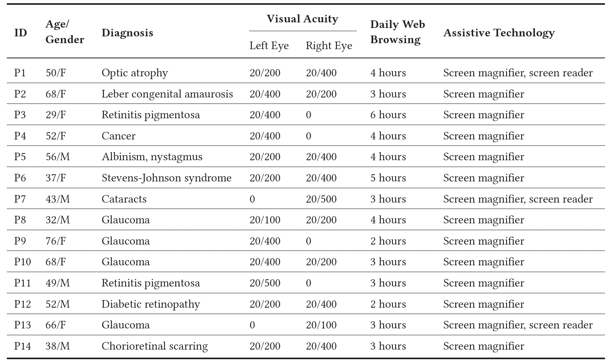
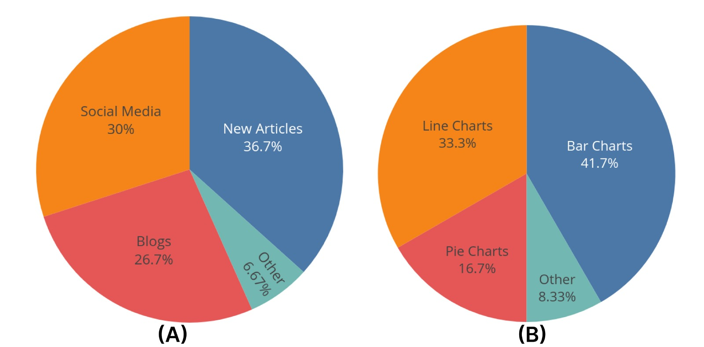

# LOW VISION USABILITY ISSUES WITH DATA CHARTS

## 1. Participants
We recruited 14 low-vision smartphone users1 (8 female, 6 male) through email lists and word-of-mouth. The average age of the participants was 51.1 (Median = 51, SD = 14 5, Range = 29-76). Our inclusion criteria required all participants to be screen-magnifier users; low-vision users with extremely low visual acuity who cannot use screen magnifiers were excluded from the interview. All participants were familiar with at least one screen magnifier (e.g., ZoomText, Android Magnification accessibility service(https://support.google.com/accessibility/android/answer/6006949), Apple Zoom(https://support.apple.com/en-in/guide/machelp/mh40579/mac). The participants mentioned that they frequently interact with charts online for either professional, educational, or personal reasons.

## 2. Interview Format

All interviews were conducted remotely via either Skype or Zoom teleconferencing software. The interviews were semi-structured, with questions about the following two topics:

* General questions about interaction with data charts. E.g., Do you frequently encounter or interact with data charts? Where do you typically interact with data charts? What type of data charts do you typically interact with?
* Usability issues and coping strategies while accessing data charts using screen magnifiers. E.g., What problems do you face when interpreting data charts? In what type of charts do you face the most problems? How do you work around these issues?

The participants were also allowed to illustrate the interaction issues over the conference call video. With the participants’ permission, all interview sessions were audio-recorded and also screen-captured. Each interview lasted about 30 to 45 minutes. The collected interview feedback was then qualitatively analyzed using an open coding technique, where we iteratively went over the user responses and identified key insights, pain points, and themes that reoccurred in the data. We detail some of our salient findings next.

## Table : Participant demographics for the interview study. The participants self-reported all information.

 

## Data Sources
